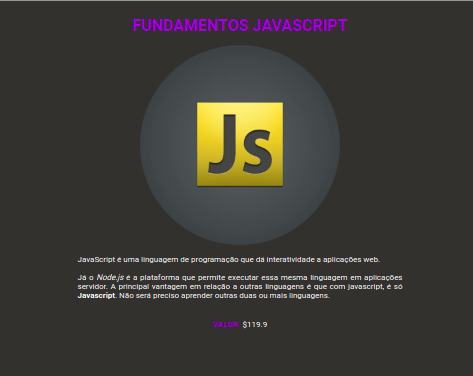

<h1 align="center">
    
</h1>

<br>

## :information_source: Sobre o repositorio
Esta e uma aplicacao que criei fazendo um curso de NextJS, onde utilizei os principais recursos deste poderoso framework de ReactJS, alem dos recursos do nextjs no projeto utilizei tambem typescript, style-components, o cms prismic, e diversas explicacoes utilizando uma fake-api, todas as anotacoes eu fiz em arquivo a parte que voce pode compreender e estudar seguindo o link abaixo:

<br>

## :hammer: Tecnologias
- nextJS
- reactJS
- typescript
- styled-components
- prismic-javascript
- prismicDOM

<br>

## 🚀 Como rodar este projeto
Para rodar esta aplicacao você precisará ter instalado em seu ambiente: nodeJS e NPM, YARN e Git
```bash
# Clone este repositório
$ git clone https://github.com/jefferson1104/nextjs-curso.git

# Acesse o projeto
$ cd nextjs-curso

# Baixe as dependencias
$ yarn

# Execute em ambiente de desenvolvimento
$ yarn dev

# faca a build da aplicacao
$ yarn build

```

<br>

## 🎨 Layout
<table>
  <tr>
    <td>
      
    </td>
    <td>
       
    </td>
  </tr>
</table>


